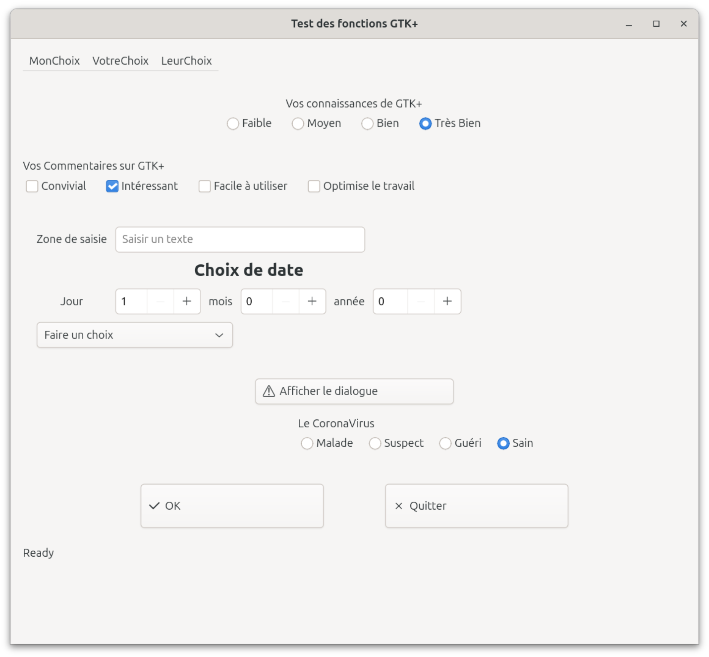
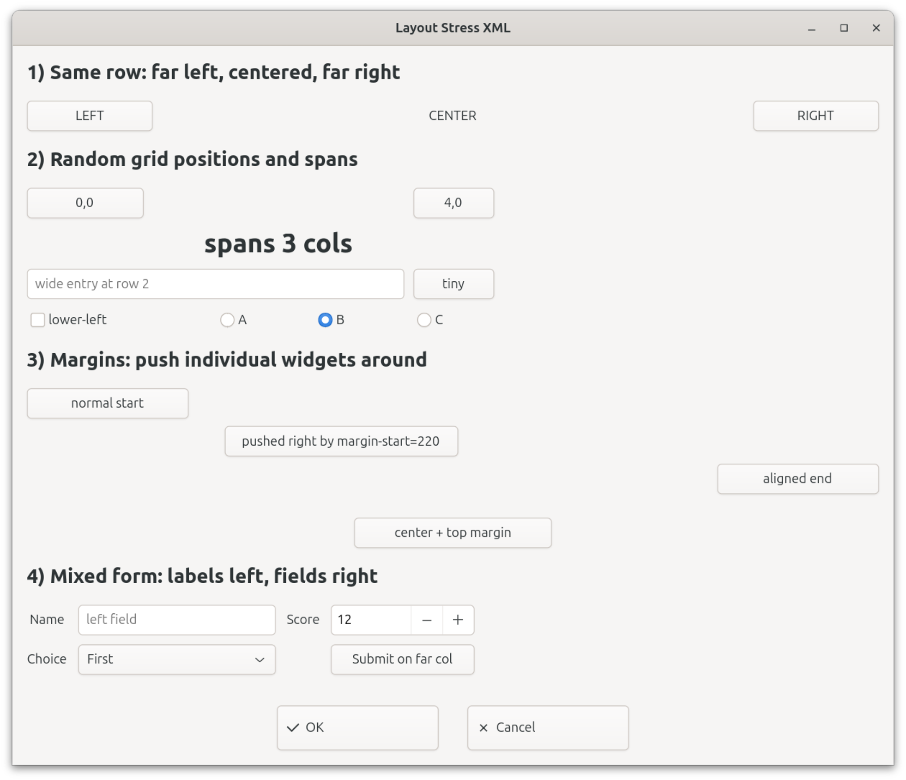

# Exam UI Guide

This guide is for the exam workflow: the teacher gives us a screenshot/PDF of a desired GTK UI, and we rebuild it with both versions of our wrapper:

- XML UI description
- C wrapper API code

The goal is speed: identify the layout, build it with wrapper widgets, run it, then take screenshots.

## Run Commands

Build the normal project:

```bash
make
```

Build the XML runner:

```bash
make build/xml-demo
```

Run the default XML example:

```bash
make xml-demo
```

Run a specific XML file:

```bash
make xml-demo XML=examples/xml/assignment_ui_short.xml
```

Or directly:

```bash
./build/xml-demo examples/xml/assignment_ui_short.xml
./build/xml-demo examples/xml/layout_stress.xml
```

Run the C API assignment example:

```bash
make assignment-api
```

Run the C API layout stress example:

```bash
make layout-stress-api
```

Useful files:

```text
examples/xml/assignment_ui_short.xml
examples/xml/layout_stress.xml
examples/c/assignment_api_main.c
examples/c/layout_stress_api_main.c
```

## Exam Workflow

1. Look at the screenshot and split it into big vertical sections.
2. Decide the container for each section.
3. Build the XML version first if speed matters.
4. Build the C API version using the same structure.
5. Run both versions and compare visually.
6. Take screenshots for the report/submission.

## Layout Mental Model

Think of the UI as a tree of containers:

```text
window
└── vertical box
    ├── menubar
    ├── radio section
    ├── checkbox section
    ├── form grid
    ├── dialog button
    └── bottom buttons
```

Use this rule of thumb:

| Need | Use |
| --- | --- |
| Top-to-bottom sections | vertical `box` |
| Left-to-right widgets | horizontal `box` |
| Labels aligned with inputs | `grid` |
| Menus | `menubar` |
| Popup | dialog callback/API |

Spacing vs margin:

- `spacing` is the gap between children inside a box/grid.
- `margin` is the space around one widget/section.
- `halign="center"` centers one widget horizontally.
- `halign="start"` keeps it on the left.
- `halign="end"` pushes it to the right.

## XML Cheat Sheet

Root window:

```xml
<window title="Test des fonctions GTK+"
        icon-name="applications-development-symbolic"
        default-width="900"
        default-height="900">
  <box orientation="vertical" spacing="16" margin="16">
    <!-- sections here -->
  </box>
</window>
```

Horizontal row:

```xml
<box orientation="horizontal" spacing="18" halign="start">
  <checkbox label="Convivial" />
  <checkbox label="Intéressant" active="true" />
  <checkbox label="Facile à utiliser" />
</box>
```

Vertical section with a title and a row:

```xml
<box orientation="vertical" spacing="4">
  <label text="Vos connaissances de GTK+" />
  <box orientation="horizontal" spacing="18">
    <radio-button id="r1" label="Faible" />
    <radio-button label="Moyen" group-with="r1" />
    <radio-button label="Bien" group-with="r1" />
  </box>
</box>
```

Grid/form layout:

```xml
<grid column-spacing="10" row-spacing="10" margin-top="24">
  <label text="Jour" col="0" row="0" />
  <spin-button min="1" max="31" value="1" width="80" col="1" row="0" />

  <label text="mois" col="2" row="0" />
  <spin-button min="0" max="12" value="0" width="80" col="3" row="0" />

  <dropdown options="Faire un choix,Choix 1,Choix 2" width="240" col="0" row="1" colspan="3" />
</grid>
```

Menubar with submenu:

```xml
<menubar halign="start">
  <menu-section label="MonChoix">
    <menu-item label="Sous Choix 1" on-activate="on_menu_about" />
    <menu-item label="Sous Choix2">
      <menu-item label="Choix221" on-activate="on_menu_about" />
      <menu-item label="Choix222" on-activate="on_menu_about" />
    </menu-item>
  </menu-section>
</menubar>
```

Useful XML shorthand:

```xml
margin="16"
margin-top="24"
margin-start="18"
width="240"
height="58"
halign="center"
css-class="title-2"
col="1"
row="2"
colspan="3"
rowspan="1"
```

## C API Cheat Sheet

Create a window:

```c
GtkWidget *window = create_window(app, &(window_config){
    .title = "Test des fonctions GTK+",
    .icon_name = "applications-development-symbolic",
    .default_width = 900,
    .default_height = 900,
    .resizable = true,
    .decorated = true,
});
```

Create the root vertical layout:

```c
GtkWidget *root = create_box(&(box_config){
    .orientation = GTK_ORIENTATION_VERTICAL,
    .spacing = 16,
    .style = {
        .margin_top = 16,
        .margin_bottom = 16,
        .margin_start = 16,
        .margin_end = 16,
    },
});
```

Add a child:

```c
container_add(root, child, 0, 0, 0, 0);
```

For grids, the last four numbers matter:

```c
container_add(grid, widget, col, row, colspan, rowspan);
```

Example form row:

```c
GtkWidget *grid = create_grid(&(grid_config){
    .column_spacing = 10,
    .row_spacing = 10,
});

container_add(grid, create_label(&(label_config){
    .text = "Jour",
}), 0, 0, 1, 1);

container_add(grid, create_spin_button(&(spin_button_config){
    .min_value = 1,
    .max_value = 31,
    .step = 1,
    .value = 1,
    .style = {.width_request = 80},
}), 1, 0, 1, 1);
```

Radio buttons in one group:

```c
GtkWidget *first = create_radio_button(&(radio_button_config){
    .label = "Faible",
});

container_add(row, first, 0, 0, 0, 0);
container_add(row, create_radio_button(&(radio_button_config){
    .label = "Moyen",
    .group_with = first,
}), 0, 0, 0, 0);
```

Dialog button:

```c
container_add(root, create_button(&(button_config){
    .label = "Afficher le dialogue",
    .icon_name = "dialog-warning-symbolic",
    .on_clicked = on_show_image_dialog,
    .user_data = state,
}), 0, 0, 0, 0);
```

## Common Patterns

Center a widget in XML:

```xml
<button label="OK" width="240" halign="center" />
```

Push a widget right with margin:

```xml
<button label="Moved right" margin-start="220" />
```

Put buttons at the bottom:

```xml
<box orientation="horizontal" spacing="80" margin-top="24" halign="center">
  <button label="OK" width="240" height="58" />
  <button label="Quitter" width="240" height="58" />
</box>
```

Equivalent C idea:

```c
GtkWidget *buttons = create_box(&(box_config){
    .orientation = GTK_ORIENTATION_HORIZONTAL,
    .spacing = 80,
    .style = {.margin_top = 24, .set_halign = true, .halign = GTK_ALIGN_CENTER},
});
```

## Current Limitations

- XML supports real `menubar`, but exact submenu opening direction is controlled by GTK popovers.
- XML cannot fully define a custom dialog yet; it can call a C callback that opens a dialog.
- The C API can create real dialogs with `show_alert_dialog`.
- The wrapper does not yet expose a `scrolled-window`, so exam scrollbars are not implemented through the wrapper yet.

## Screenshots 


hada lexam


>hada ggh bax txofo kifax t9dro t7ato dok les composant fl ecran kima bghito 
>lcode dyal hada kayn f exexmples layout stress (result dual xml or C , rah kytal3o nfs tswira/ui)


*mlohim runiw and 7elo les exemples ao xofo blan kifax kayt7at dkxi*